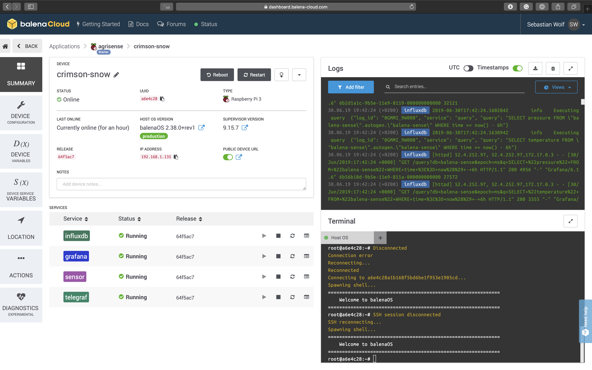
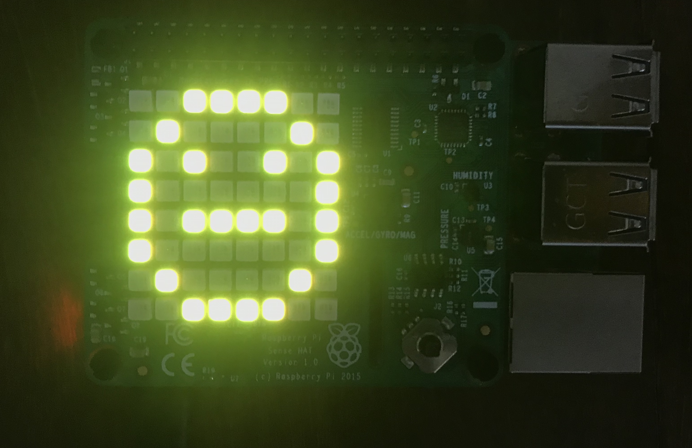

# Agriculture IoT use-case: AgriBrain

Authors: Hector Cano, Reid Falconer, Sebastian Wolf

## Project description

AgriBrain is an agriculture and irrigation management system that integrates monitoring, analysis and automation into a single platform, enabling farmers to maximize productivity any time, from anywhere.

AgriBrain provides farmers with real-time recommendations based on data pertaining to plant, soil and weather conditions obtained from sensors in the field. This data is analyzed in the cloud, using AgriBrains' proprietary modelling software.

AgriBrain is a unique platform that integrates monitoring, analysis and automation in one system, controlled by the farmer through a friendly and straightforward user interface, that provides optimization and smart recommendations throughout all stages of the crop lifecycle - saving water, fertilizer, inputs and improving profitability.

AgriBrain is an innovative product that is continuously building creative technology solutions that help the world grow more food with fewer resources. From companies cultivating large areas of land to smallholder farmers in developing countries, AgriBrain gives every farmer a way to maximize results and enjoy an accessible, friendly and advanced user interface.

## Guide for folders:

- IoT Tools
- Dashboard
- Presentation

## Installation guides for IoT device

### Option 1
- **IoT device collecting weather/humidity data**
- **Python IoT app deployed in a Docker container via balenaCloud**
- **Grafana dashboard to analyze data**

One option to deploy AgriBrain is via [balena](https://www.balena.io). balena offers a slim Linux distribution for IoT devices that connects to the cloud and makes it simple to deploy apps via [Docker](https://www.docker.com) containers on a whole fleet of IoT devices simultanenously.

Deploying a new application to connected devices is as simple as pushing a commit to the cloud - it then immediately starts running on our IoT device fleet.

#### Setting up the IoT device and connecting it to our fleet management system
The steps to install balenaOS on your IoT are:

(1) Create an account on [balena.io](https://www.balena.io)

(2) Follow instructions on [balena.io](https://www.balena.io) to create an application. We call ours 'agribrain'. Then download the OS image that is created.

(3) Flash the image on your IoT SD storage, for example using balenaEtcher. Insert it in the IoT device and power it up.

(4) Voila: Find the IoT device online in your balena dashboard:



#### Deploying agriBrain on our IoT fleet
We are now ready to push an application to the IoT fleet via balenaCloud. For this, we need to install the balena CLI, which allows us to push applications to our balena account on balenaCloud, from where it gets deployed to our IoT device and starts running. To install the balena CLI, get the latest package from the [balena github](https://github.com/balena-io/balena-cli#standalone-install).

After installing the CLI, we run ```$ balena login``` to connect the CLI to your balena account. Now we can simply issue ```$ balena push agribrain``` from within the folder of the application we built. This containerizes our application in Docker, and pushes it to the IoT device fleet. We can then control our applications from the balena dashboard.

The IoT devices will now start collecting data to help agriBrain provide feedback to the farmer. The farmer can access the data through the dashboard described below, but can also gets on-location feedback from the IoT devices, and enter commands:



#### Running the agriBrain dashboard
The farmer can access the agriBrain data through a dashboard [Grafana](https://github.com/grafana/grafana), which analyses historical data collected by the device fleet, pulls a forecast of the weather, and suggests whether to water a plot or not, and how much.


Here is a link to one of our live devices, deployed on a micro-farm in Barcelona: [live dashboard](https://a6e4c28a1b168f5bd6be1f953e1905cd.balena-devices.com/d/pF3gRDiRk/agribrain?orgId=1&kiosk=tv)


### Option 2
- **Ubuntu on IoT device collecting weather/humidity data**
- **Python IoT app deployed via Azure**
- **RShiny dashboard to analyse data**
