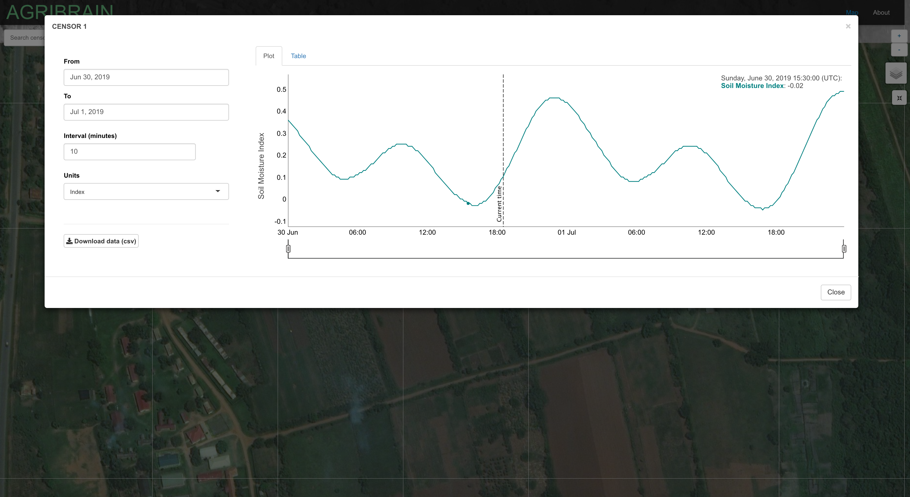

# Agriculture IoT use-case: AgriBrain

Authors: Hector Cano, Reid Falconer, Sebastian Wolf

## Project description

AgriBrain is an agriculture and irrigation management system that integrates monitoring, analysis and automation into a single platform, enabling farmers to maximize productivity any time, from anywhere.

AgriBrain provides farmers with real-time recommendations based on data pertaining to plant, soil and weather conditions obtained from sensors in the field. This data is analyzed in the cloud, using AgriBrains' proprietary modelling software.

AgriBrain is a unique platform that integrates monitoring, analysis and automation in one system, controlled by the farmer through a friendly and straightforward user interface, that provides optimization and smart recommendations throughout all stages of the crop lifecycle - saving water, fertilizer, inputs and improving profitability.

AgriBrain allows small-holder farmers to share their data with large-scale farmers, decreasing quality control costs, and providing a record on which to base credit decisions and pricing. 

AgriBrain is an innovative product that is continuously building creative technology solutions that help the world grow more food with fewer resources. From companies cultivating large areas of land to smallholder farmers in developing countries, AgriBrain gives every farmer a way to maximize results.

## How it works
- deploy IoT devices in farms to gather data on soil and weather conditions; collect further data throgh remote sensing (sensors)
- connect IoT decvices to water pumps or irrigation system (actuators)
- collect IoT data in a farm fog, or directly in the cloud
- run predictions on farm-level weather development in the cloud
- use sensors and edge compting to control action of actuators based on predicitions from the cloud service

## Prototype implementation
- Python app to control IoT sensors, deployed in Docker container
- Balena as IoT fleet management system pushing updates
- Influx DB to collect data
- Grafana dashboad to explore realtime data and give farmer feedback
- Rshiny to interact with the analytics engine

## Guide for folders:
- IoT Tools
  - sensor: Python app to control IoT sensor
  - telegraf: data exchange with database
  - influxdb: database
  - grafana: dashboard
- agribrain-shiny: Analytics engine
- Presentation

## Protoype installation guide

The option we chose to deploy AgriBrain for this protoype is via [balena](https://www.balena.io). balena offers a slim Linux distribution for IoT devices that connects to the cloud and makes it simple to deploy apps via [Docker](https://www.docker.com) containers on a whole fleet of IoT devices simultanenously.

Deploying a new application to connected devices is as simple as pushing a commit to the cloud - it then immediately starts running on our IoT device fleet.

### Setting up the IoT device and connecting it to our fleet management system
The steps to install balenaOS on your IoT are:

(1) Create an account on [balena.io](https://www.balena.io)

(2) Follow instructions on [balena.io](https://www.balena.io) to create an application. We call ours 'agribrain'. Then download the OS image that is created.

(3) Flash the image on your IoT SD storage, for example using balenaEtcher. Insert it in the IoT device and power it up.

(4) Voila: Find the IoT device online in your balena dashboard.

**Fleet management suite:**


### Deploying agriBrain on our IoT fleet
We are now ready to push an application to the IoT fleet via balenaCloud. For this, we need to install the balena CLI, which allows us to push applications to our balena account on balenaCloud, from where it gets deployed to our IoT device and starts running. To install the balena CLI, get the latest package from the [balena github](https://github.com/balena-io/balena-cli#standalone-install).

After installing the CLI, we run ```$ balena login``` to connect the CLI to your balena account. Now we can simply issue ```$ balena push agribrain``` from within the folder of the application we built. This containerizes our application in Docker, and pushes it to the IoT device fleet. We can then control our applications from the balena dashboard.

The IoT devices will now start collecting data to help agriBrain provide feedback to the farmer. The farmer can access the data through the dashboard described below, but can also gets on-location feedback from the IoT devices, and enter commands.

**IoT device for Sensor feedback, interaction with actuators:**


### Running the grafana agriBrain dashboard for data exploration
The farmer can access the agriBrain data through a dashboard [Grafana](https://github.com/grafana/grafana), which analyses historical data collected by the device fleet, pulls a forecast of the weather, and suggests whether to water a plot or not, and how much.

**Grafana dashboard to explore real-time data**


Here is a link to one of our live devices, deployed on a micro-farm in Barcelona:
[live dashboard](https://a6e4c28a1b168f5bd6be1f953e1905cd.balena-devices.com/d/pF3gRDiRk/agribrain?orgId=1&kiosk=tv)

### Running the analytics app to interact with the analytics engine
The agribrain-shiny folder contains the [Shiny App](https://rstudio.github.io/shinydashboard/) to interact with the analytics engine  that displays the three AgriBrain sensors located in Uganda. Each sensor captures soil moisture levels for there given crop (both past and predicted values) and further allows the user to download the data in a csv format. 

1. Make sure you have [R](https://cran.r-project.org/doc/manuals/r-release/R-admin.html) installed *(Pretty important step in this process)*

2. Through your favorite R interface, be sure you `install.packages` for both shiny and shinydashboard along with all the packages found in the `global.R` script.

3. Clone this repo

4. You should be good to go!! Make sure your cwd is set to the base level of this repo. run `shinyApp()` in your console, or click the `Run App` button in RStudio.

5. You should see sth as below.

**Analytics engine:**



